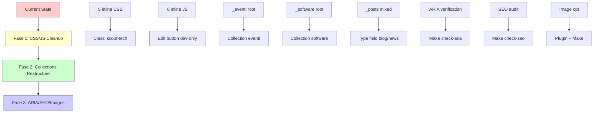

# Jekyll 4 Refactor Design - BitPrepared.it

**Data**: 2026-05-01
**Approccio**: Incremental Phased (Approccio B)
**Timeline**: 4-6 weeks
**Status**: Design approvato

---

## Overview

Refactoring sito Jekyll 4 bitprepared.it con obiettivi:
- Zero inline CSS/JS (eccezioni legittime: JSON-LD SEO, tags page con Liquid)
- Collections pulite per eventi, software, news
- Sistema verifica ARIA + SEO audit
- Ottimizzazione immagini 3 formati
- Design system base per coerenza grafica

---

## Architettura Generale



---

## Fase 1: CSS/JS Cleanup

### Obiettivo
Rimuovere inline styles/scripts, mantenere funzionalità esistente.

### CSS Cleanup (5 occorrenze)

**Problema**:
- index.html: 3 occorrenze `style="color: #0a3d0a;"` (titoli card)
- index.html: 2 occorrenze `style="color: #666666;"` (descrizioni card)

**Soluzione**:
Aggiungi classi utility a `assets/css/scout-tech.css`:
```css
/* Brand colors */
.text-brand-dark { color: #0a3d0a; }
.text-muted { color: #666666; }
```

**Implementazione**:
```html
<!-- Prima -->
<h3 style="color: #0a3d0a;">Campo di Competenza EG</h3>
<p style="color: #666666;">Google, social...</p>

<!-- Dopo -->
<h3 class="text-brand-dark">Campo di Competenza EG</h3>
<p class="text-muted">Google, social...</p>
```

**File modificati**:
- `assets/css/scout-tech.css` (+2 righe)
- `index.html` (-5 style attributes)

### JS Cleanup (1 script da spostare)

**Analisi inline scripts**:
1. ✅ `index.html:9` - JSON-LD schema (SEO, legittimo)
2. ✅ `_layouts/evento.html:95` - JSON-LD schema (SEO, legittimo)
3. ✅ `tags/index.md` - Tags navigation (Liquid variables, necessario)
4. ❌ `_includes/edit-button.html:17` - Development editor (spostare)

**Soluzione**:
Sposta edit button in `assets/js/edit-button-dev.js`, escludi da production.

**Implementazione**:
1. Crea `assets/js/edit-button-dev.js`:
```javascript
// Development-only edit button
// Caricato solo in development environment
(function() {
  const HOST_PROJECT_PATH = window.SITE_PROJECT_PATH;
  // ... resto del codice
})();
```

2. Aggiungi a `_includes/edit-button.html`:
```html

<script src="{{ site.baseurl }}/assets/js/edit-button-dev.js"></script>

```

3. Passa variabili Liquid via data attribute:
```html
<script
  data-project-path="{{ site.project_path }}"
  data-page-path="{{ page.path }}"
  src="{{ site.baseurl }}/assets/js/edit-button-dev.js">
</script>
```

**File modificati**:
- `assets/js/edit-button-dev.js` (nuovo)
- `_includes/edit-button.html` (semplificato)
- `_config.yml` (escludi dev-only da production se necessario)

### Checklist Fase 1
- [ ] Aggiungi `.text-brand-dark`, `.text-muted` a scout-tech.css
- [ ] Sostituisci 5 inline styles in index.html
- [ ] Crea assets/js/edit-button-dev.js
- [ ] Modifica _includes/edit-button.html
- [ ] Test compilation: `jekyll build`
- [ ] Test visual: `make validate-graphics`

---

## Fase 2: Collections Restructure

### Obiettivo
Struttura pulita per contenuti: eventi, software, blog/news in collections dedicate.

### Stato Attuale
```yaml
_config.yml:
  collections:
    eventi:    # Già configurata
      output: true
    software:  # Già configurata
      output: true

Directory:
  _eventi/     # File sparsi
  _software/   # File sparsi
  _posts/      # Blog + news misti
```

### Blog vs News

**Soluzione**: Type field in frontmatter, non collections separate.

**Implementazione**:
```yaml
---
title: "Post di blog"
type: blog  # o "news"
layout: post
---
```

**Template filtering**:
```liquid
<!-- Pagina blog: mostra solo type: blog -->

  
    <!-- render post -->
  


<!-- Pagina news: mostra solo type: news -->

  
    <!-- render post -->
  

```

### Collections Miglioramenti

**Aggiungi permalink personalizzati**:
```yaml
# _config.yml
collections:
  eventi:
    output: true
    permalink: /eventi/:name/
  software:
    output: true
    permalink: /software/:name/
```

**Directory structure target**:
```
bitprepared.it/
├── _posts/          # Blog (type: blog) + News (type: news)
├── _eventi/         # Collection eventi
├── _software/       # Collection software
├── blog/            # Pagina indice blog (type: blog)
└── news/            # Pagina indice news (type: news)
```

### Nuove Pagine Indice

**blog/index.md**:
```yaml
---
layout: page
title: Blog
permalink: /blog/
---

  
    <!-- blog card -->
  

```

**news/index.md**:
```yaml
---
layout: page
title: News
permalink: /news/
---

  
    <!-- news card -->
  

```

### Checklist Fase 2
- [ ] Verifica permalink collections in _config.yml
- [ ] Aggiungi type: blog/news a posts esistenti
- [ ] Crea blog/index.md
- [ ] Crea news/index.md
- [ ] Aggiorna navigazione in _includes/nav.html
- [ ] Test permalink: `jekyll build && find _site -name "*.html"`

---

## Fase 3: ARIA + SEO + Immagini

### Obiettivo
Accessibilità, SEO, performance immagini.

### ARIA Verification System

**Make command**: `make check-aria`

**Script**: `scripts/check-aria.js`

**Implementazione**:
```javascript
// Estrae tutti gli ARIA tags dal sito generato
const fs = require('fs');
const glob = require('glob');
const cheerio = require('cheerio');

const ariaTags = ['aria-label', 'aria-describedby', 'aria-hidden', 'role', 'aria-live'];
const report = {};

glob.sync('_site/**/*.html').forEach(file => {
  const html = fs.readFileSync(file, 'utf8');
  const $ = cheerio.load(html);

  ariaTags.forEach(tag => {
    $(`[${tag}]`).each((i, el) => {
      const line = html.substring(0, el.startIndex).split('\n').length;
      report[file] = report[file] || [];
      report[file].push({
        tag,
        value: $(el).attr(tag),
        element: el.tagName,
        line
      });
    });
  });
});

fs.writeFileSync('aria-report.json', JSON.stringify(report, null, 2));
```

**Output**: `aria-report.json`
```json
{
  "_site/index.html": [
    {
      "tag": "aria-label",
      "value": "Events and activities",
      "element": "section",
      "line": 45
    }
  ]
}
```

**Makefile**:
```makefile
check-aria:
	@echo "Checking ARIA tags..."
	@node scripts/check-aria.js
	@echo "ARIA report: aria-report.json"
```

### SEO Audit

**Classic SEO**: già presente con `jekyll-seo-tag` plugin.

**AI SEO**: Schema.org markup già presente in index.html.

**Make command**: `make check-seo`

**Implementazione**:
```bash
check-seo:
	@echo "Running SEO audit..."
	@npm run seo-audit || echo "Install seo-audit tool"
```

### Image Optimization Pipeline

**Jekyll Plugin**: `jekyll-picture-tag`

**Gemfile**:
```ruby
gem 'jekyll-picture-tag', '~> 2.0'
```

**Config**: `_picture_tag.yml`
```yaml
presets:
  default:
    formats: [webp, original]
    widths: [640, 1024, 1920]
    fallback: true
```

**Utilizzo**:
```html

```

**Make command**: `make optimize-images`

**Script**: `scripts/optimize-images.js`
```javascript
const sharp = require('sharp');
const glob = require('glob');

glob.sync('assets/images/**/*.{jpg,png}').forEach(file => {
  // Genera 3 formati
  [640, 1024, 1920].forEach(width => {
    sharp(file)
      .resize(width)
      .webp()
      .toFile(`_site/images/${width}/${path.basename(file)}`);
  });
});
```

**Preservazione originali**:
- Originali in `assets/images/` (non toccati)
- Ottimizzati in `_site/images/` (solo build)
- Srcset responsive in HTML

### Checklist Fase 3
- [ ] Installa jekyll-picture-tag
- [ ] Crea scripts/check-aria.js
- [ ] Aggiungi make check-aria
- [ ] Crea scripts/optimize-images.js
- [ ] Aggiungi make optimize-images
- [ ] Test aria report
- [ ] Test image optimization

---

## Dependencies

### Esterno
- `cheerio` → HTML parsing per ARIA check
- `sharp` → Image optimization
- `jekyll-picture-tag` → Responsive images

### Interno
- Fase 2 dipende da Fase 1 (code base pulito)
- Fase 3 dipende da Fase 2 (struttura contenuti stabile)

---

## Testing Strategy

### Fase 1 Testing
```bash
# 1. CSS cleanup
jekyll build
make validate-graphics  # Visual regression

# 2. JS cleanup
jekyll build
grep -r "style=" _site  # Verifica zero inline CSS
```

### Fase 2 Testing
```bash
# Collections
jekyll build
find _site/eventi -name "*.html" | wc -l  # Verifica output
find _site/software -name "*.html" | wc -l

# Blog/News filtering
curl http://localhost:4000/blog/ | grep "type: blog"
curl http://localhost:4000/news/ | grep "type: news"
```

### Fase 3 Testing
```bash
# ARIA
make check-aria
cat aria-report.json | jq .

# Images
make optimize-images
ls -lh _site/images/640/
ls -lh _site/images/1920/
```

---

## Timeline

| Fase | Durata | Start | End |
|------|--------|-------|-----|
| Fase 1 | 1-2 weeks | 2026-05-01 | 2026-05-15 |
| Fase 2 | 1-2 weeks | 2026-05-15 | 2026-05-30 |
| Fase 3 | 2 weeks | 2026-05-30 | 2026-06-13 |

**Totale**: 4-6 weeks

---

## Rischi e Mitigazioni

### Rischio: Breaking changes in Fase 1
**Mitigazione**: Visual regression testing dopo ogni modifica

### Rischio: Collections permalink mismatch
**Mitigazione**: Test completo `find _site` dopo Fase 2

### Rischio: Image optimization lento
**Mitigazione**: Cache sharp outputs, make command opzionale

---

## Next Steps

1. ✅ Design approvato
2. ⏭️ Scrivi implementation plan (superpowers:writing-plans skill)
3. ⏭️ Inizia Fase 1 implementazione

---

**Documento**: 2026-05-01-jekyll4-refactor-design.md
**Stato**: APPROVED
**Prossima azione**: Invoca writing-plans skill
